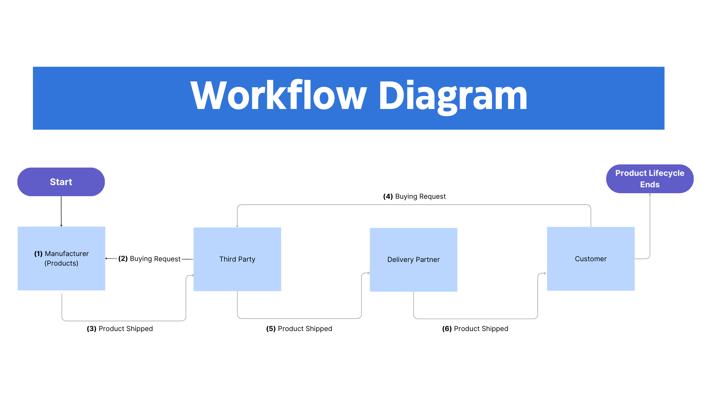

# Blockchain-Based Supply Chain Verification System

<p align="center">
  
</p>

## Overview
A blockchain-based system for transparent and secure supply chain verification using [Solidity](https://docs.soliditylang.org/en/v0.8.4/).

---

## Technology Stack

<p align="center">
  
  
  
  
  
  
  
  
</p>

---

## Features
- **Smart Contract Implementation**: Automated verification using smart contracts.
- **Real-Time Product Tracking Dashboard**: A dashboard for real-time tracking of products.
- **Incident Reporting and Alert System**: A system for reporting incidents and sending alerts.

---

## Supply Chain Flow

<p align="center">  
      
</p>

---

## Installation and Setup

### Prerequisites
- [Node.js](https://nodejs.org/)
- [Git](https://git-scm.com/)
- [Docker](https://www.docker.com/) *(Optional)*

### Steps
Clone the repository:
```bash
git clone https://github.com/rishav4101/eth-supplychain-dapp.git && cd eth-supplychain-dapp
```

Install dependencies:
```bash
npm install
```

Install Ganache CLI:
```bash
npm install -g ganache-cli
```

Run Ganache CLI:
```bash
ganache-cli --accounts 10 --gasLimit 6721975000
```

Alternatively, using Docker:
```bash
sudo docker run -d -p 8545:8545 trufflesuite/ganache-cli:latest -h 0.0.0.0 --accounts 10 --gasLimit 6721975000
```

Migrate the contracts:
```bash
truffle migrate --network=develop --reset
```

Go to the client directory:
```bash
cd client
```

Install frontend dependencies:
```bash
npm install
```

Set up environment variables:
```bash
echo "REACT_APP_GOOGLE_MAP_API_KEY=your_api_key_here" >> .env
echo "REACT_APP_RPC=http://127.0.0.1:8545/" >> .env
```

Start the application:
```bash
npm start
```

---

## License
This project is licensed under the [MIT License](https://opensource.org/licenses/MIT).

---

## Additional Resources
- [Solidity Documentation](https://docs.soliditylang.org/en/v0.8.4/)
- [React Documentation](https://reactjs.org/docs/getting-started.html)
- [Truffle Documentation](https://www.trufflesuite.com/docs/truffle/reference/configuration)
- [Ganache CLI Documentation](https://www.trufflesuite.com/docs/ganache/overview)

